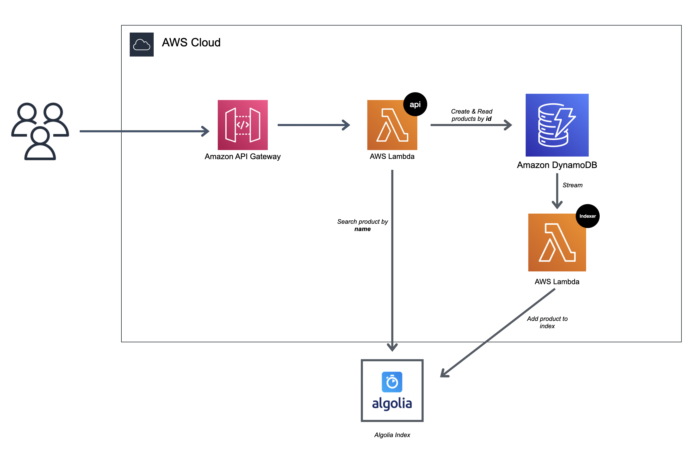

# Producti

Producti is a product API written in Go for e-commerce websites.

## Compilation

For the `api` lambda :
```
$ go build -o api cmd/api/main.go
```


For the `indexer` lambda :
```
$ go build -o indexer cmd/indexer/main.go
```

## Deployment

### Prerequisites

* Create an AWS Account
* Create an IAM user
* Save your AWS credentials into a named profile. [Instructions Here](https://docs.aws.amazon.com/cli/latest/userguide/cli-configure-profiles.html)
* Install Node.js and NPM: [see here](https://nodejs.org/en/download/)
* Install Serverless globally `npm install -g serverless`
* Install Go [see here](https://golang.org/dl/)
* Install make (should be already installed on MacOS and some Linux distros, installation necessary for Windows)


### Deployment in `develop` stage

```
$ make deploy_develop
```

### Deployment in `prod` stage

```
$ make deploy_prod
```

## Architecture

The project is deployed to the AWS cloud with the Serverless framework.



* An API gateway will accept incoming requests
* Those requests are sent to an AWS Lambda (`api`) that will treat incoming requests
* Products are stored into a DynamoDb database
* Thanks to DynamoDb streams, for each new record another Lambda is launched (`indexer`), this lambda will create add an object
 to an Algolia Index
    * to get more info about DynamoDb Streams : [see here](https://www.serverless.com/blog/event-driven-architecture-dynamodb) 
* When a search by product name occurs, a queery is made to the Algolia Index


## Contributing

Pull requests are welcome. For major changes, please open an issue first to discuss what you would like to change.

Please make sure to update tests as appropriate.

## License
[MIT](https://choosealicense.com/licenses/mit/)